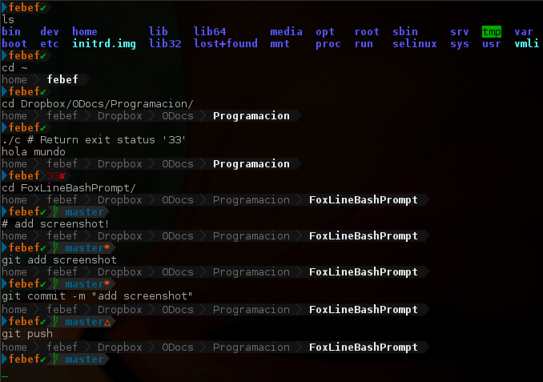

FoxLineBashPrompt
=================

FLBP is a simple  configuration for bash... PS1...

How to test
===========

Clone git repo in a folder x, and run TestFLBP.sh !

pd: you need have installed powerline font.

####Install font:
* Per User:
Run the following commands in terminal:

        wget https://github.com/Lokaltog/powerline/raw/develop/font/PowerlineSymbols.otf https://github.com/Lokaltog/powerline/raw/develop/font/10-powerline-symbols.conf
        mkdir -p ~/.fonts/ && mv PowerlineSymbols.otf ~/.fonts/
        fc-cache -vf ~/.fonts
        mkdir -p ~/.config/fontconfig/conf.d/ && mv 10-powerline-symbols.conf ~/.config/fontconfig/conf.d/
    
* System wide:
Run the following commands in terminal:

        wget https://github.com/Lokaltog/powerline/raw/develop/font/PowerlineSymbols.otf https://github.com/Lokaltog/powerline/raw/develop/font/10-powerline-symbols.conf
        mv PowerlineSymbols.otf /usr/share/fonts/
        fc-cache -vf
        mv 10-powerline-symbols.conf /etc/fonts/conf.d/

--------------------------------------------------------------------------------------

» Thanks to sexy-bash-prompt : https://github.com/twolfson/sexy-bash-prompt
